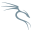

 I'm Mohamed Nachit. I'm a 20-year-old developer from Morocco with a passion for web and mobile development. I love creating innovative and efficient solutions.

Let's code together.

     
    
    
    
    
    
    
    
    
    
    

Stay linked:

      <a href="https://www.instagram.com/siimo_nachit/" target="_blank" rel="noreferrer"> 
          <picture> 
            <source media="(prefers-color-scheme: dark)" srcset="./img/icons8-instagram.svg" /> 
            <source media="(prefers-color-scheme: light)" srcset="./img/icons8-instagram(1).svg" /> 
            
          </picture>
      </a>&nbsp;&nbsp;&nbsp;
      <a href="https://discord.com/users/simo3334" target="_blank" rel="noreferrer">
        <picture> 
          <source media="(prefers-color-scheme: dark)" srcset="./img/discord-dark.svg" /> 
          <source media="(prefers-color-scheme: light)" srcset="./img/icons8-discord(2).svg" />
           
        </picture> 
        </a>&nbsp;&nbsp;&nbsp;
 <a href="mailto:siimonachitt11@gmail.com" target="_blank"  rel="noreferrer">
        <picture> 
          <source media="(prefers-color-scheme: dark)" srcset="./img/icons8-gmail(3).svg" /> 
          <source media="(prefers-color-scheme: light)" srcset="./img/icons8-gmail(2).svg" />
           
        </picture>
          </a>&nbsp;&nbsp;&nbsp;
      <a href="https://www.linkedin.com/in/anime-art-45396329a/" target="_blank" rel="noreferrer"> 
          <picture> 
            <source media="(prefers-color-scheme: dark)" srcset="./img/icons8-linkedin(2).svg" /> 
            <source media="(prefers-color-scheme: light)" srcset="./img/icons8-linkedin(1).svg" /> 
             
          </picture> 
      </a> &nbsp;&nbsp;&nbsp;
      <a href="https://stackoverflow.com/users/22895520/simo-nachit" target="_blank" rel="noreferrer"> 
      <picture> <source media="(prefers-color-scheme: dark)" srcset="./img/icons8-stack-overflow.svg" />
      <source media="(prefers-color-scheme: light)" srcset="./img/icons8-stack-overflow(1).svg" />  </picture> </a>
      

